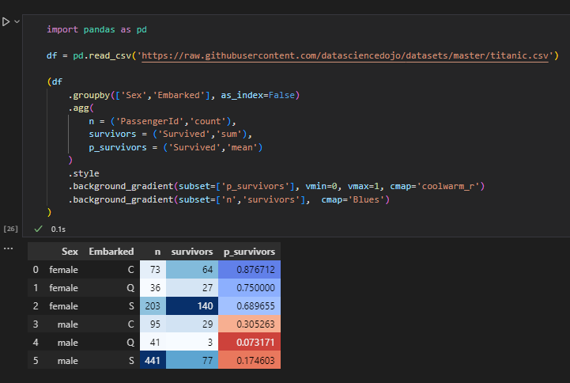

Did you know about `.background_gradient()`? Before today no!

<p align="center">
  
</p>

I did not ... and now I do! And that thanks to a tweet from Karina Bartolomé and the screen capture below:

<p align="center">
  
  All rights reserved to Karina Bartolomé for the screen capture
</p>

## What is `.background_gradient()`?

It is a styling format from the library `pandas` in Python.

If you want to know more and read the documentation, you can follow this link [https://pandas.pydata.org/docs/reference/api/pandas.io.formats.style.Styler.background_gradient.html](https://pandas.pydata.org/docs/reference/api/pandas.io.formats.style.Styler.background_gradient.html)

## Example from the tweet

If you want to copy/paste this coe, I reproduced it for you below:
```python
import pandas as pd

df = pd.read_csv('https://github.com/datasciencedojo/datasets/blob/master/titanic.csv')

(df 
  .groupby
  .agg(
    n = ('PassengerId','count')
    survivors = ('Survived','sum')
    p_survivors = ('Survived','mean')
  )
  .style
  .background_gradient(subset=['p_survivors'], vmin=0, vmax=1, cmap='colorwarn_r')
  .background_gradient(subset=['n','survivors'], cmap='blues')
)
```

For the purpose of this example, it was done using a Python Notebook

## Source of this tip on `.background_gradient()`

I saw this tip on Twitter and it was shared by Karina Bartolomé:

<blockquote class="twitter-tweet"><p lang="en" dir="ltr">.background_gradient() <a href="https://t.co/nUhdhkv6yf">pic.twitter.com/nUhdhkv6yf</a></p>&mdash; Karina Bartolomé (@karbartolome) <a href="https://twitter.com/karbartolome/status/1542688636789035011?ref_src=twsrc%5Etfw">July 1, 2022</a></blockquote> <script async src="https://platform.twitter.com/widgets.js" charset="utf-8"></script>

All rights reserved to Karina Bartolomé and her tip with `.background_gradient()` in her tweet.