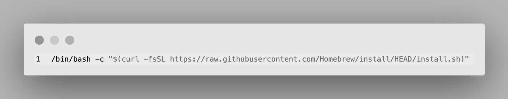
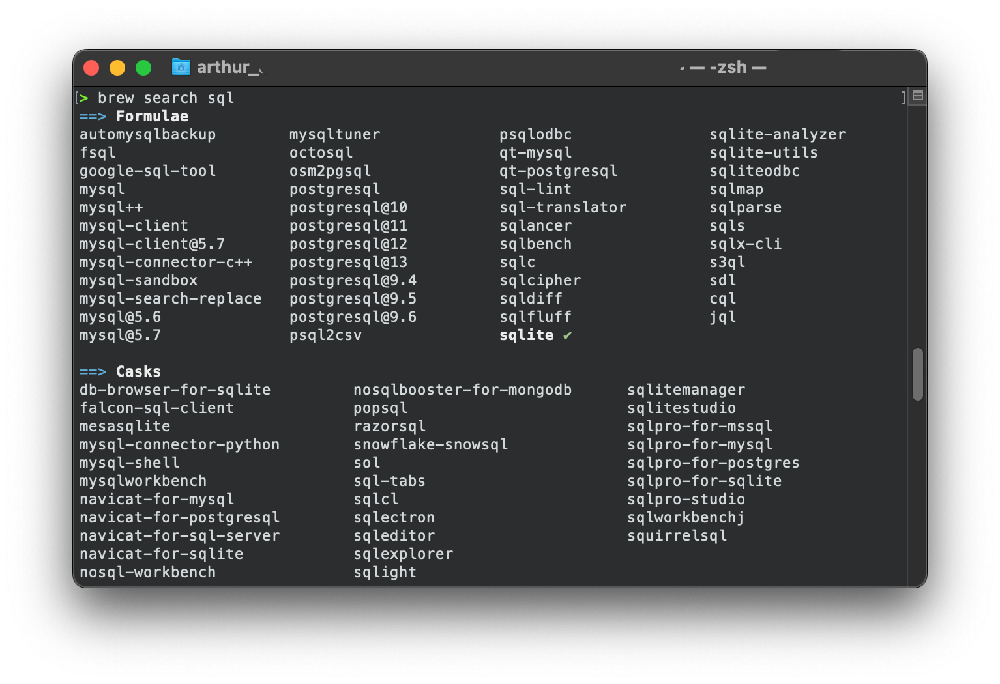

Do you know what `brew` (Homebrew) is? If the answer is no & that you are using MacOS and your Terminal ... how are you doing? ;-)

<p align="center">
  
</p>


## What is brew?

Brew (or Homebrew) is what we would call an indispensable package manager for macOS. On their website they say that they are _The Missing Package Manager for macOS_

## How to install `brew`?

To install `brew`, you will have to add this command in your Terminal

```
/bin/bash -c "$(curl -fsSL https://raw.githubusercontent.com/Homebrew/install/HEAD/install.sh)"
```

This is coming from the official website [https://brew.sh/](https://brew.sh/). And don't worry the script explains what it will do and then pauses before it does it. If you are looking for other ways to install this package manager on you machine, the website provide a dedicated page [https://docs.brew.sh/Installation](https://docs.brew.sh/Installation)

## `brew` tips

### Install something with Homebrew

To install something thanks to Homebrew, the command is `brew` + `install` + `{what you're looking for}`. Let's take some examples with `curl` & `python`.

For the first one (`curl`), it would be:
```
brew install curl
```

For the second one ([python](/tags/python)), that would mean:

```
brew install python
```

### Search for something

You have two options for searching something with `brew`: (1) from your terminal with `brew` + `search` + `{keyword}` or (2) going to the website.

In the case below, I am looking for something related to [SQL](/tags/sql).
```
brew search sql
```

Below you can find the results from my Terminal:

<p align="center">
  
</p>


Another way to do a search with brew is to gor to theire website [https://brew.sh/](https://brew.sh/) and use the search there. Below you will see an example with _Spotify_ (because yes you can install some "real software, calles _Casks_):

<p align="center">
  
</p>

### Not sure what a _Formulae_ or a _Casks_ is doing?

Don't worry, Homebrew got you cover thanks to `desc`, which will give you a small description. Always useful before installing something for sure.

In your Terminal, you could do:
```
brew desc {something you are looking for}
```

For example:

```
> brew desc wget
wget: Internet file retriever
```

## What I recommend you to install

For SEO, Python, data, ... stuff, I would recommend you to use `brew` to install some _Formulae_ and some _Casks_ like `python`, `wget`, `curl` (yes both, always useful), Screaming Frog, Spotify & Calibre. But why using Homebrew instead of downloading the software and installing it? Because here it does (1) Download, (2) Installation, (3) You don't have to drag & drop, (4) nore eject dmg.

### You know me, install python ;-)

Yes, if you are curious and on this blog, you might already have installed it, but if it's not the case, you can use `brew` to install it this way:

```
brew install python
```

### Both `weget` and `curl`

Yes, both of them, this is always useful to have both of them to "play" and get the answer you are looking for!

```
brew install curl
```

```
brew install wget
```

### Screaming Frog, yes you read it well!

SEO will love that: you can install Screaming From with one line of `brew install`. And then, you will also be able to launch Screaming Frog from your Terminal!

```
brew install screaming-frog-seo-spider
```

### Spotify, to get some music while working/coding

If you are like me -- Team Spotify -- you will be glad to see that you can use Homebrew to install Spotify.

```
brew install spotify
```

### Calibre for you to read

Also, if you like to read ebooks, I reacomment you the software _Calibre_. This software is really good and cool to help you manage your digital book library.

```
brew install calibre
```

### Many other Casks

You can for sure install some other software like `google-chrome`, `firefox`, `brave-browser`

---

## Learn more about `brew`

There are a lot of ressources out there to learn about brew, one in French I really like is the video made by Korben (from Korben.info)
- 🇫🇷 [article](https://korben.info/comment-utiliser-brew.html)
- 🇫🇷 [video](https://www.youtube.com/watch?v=gjtzeC0UINQ)