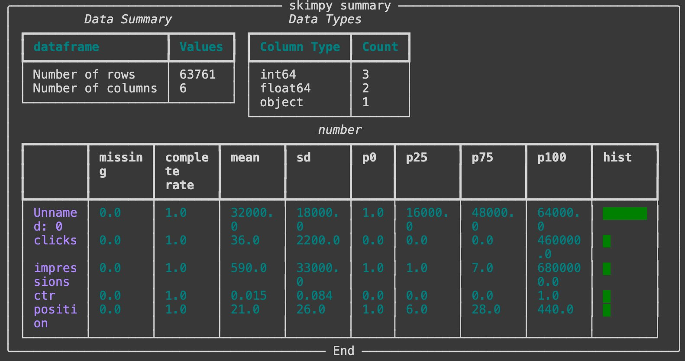

Another Python and Data post today for you, by me, with the help of what I read on Twitter ... and used. Now it's time to share it with you too!

<p align="center">
  
</p>

## What is skimpy?

> skimpy is a light weight tool that provides summary statistics about variables in data frames within the console.
-- Philip Vollet

I tested it just after seeing the tweet. And I could say it's great and I like it! Yes, it's no news that I like [data]() and this library from Python could be used for [SEO]() purposes.

## How to install skimpy?

You can:
1. go to [https://github.com/aeturrell/skimpy](https://github.com/aeturrell/skimpy)
2. do a `pip install`
3. load it thanks to `from skimpy import skim`
4. test it on your dataframe `skim(df)`

<p align="center">
  
</p>

These steps are:

```python
!pip install
from skimpy import skim
skim(df)
```

Where `df` will be your dataframe with you own data. If you want to test it out of the box, there is a test data df that you can create with `df = generate_test_data()`

## What could be the output of skimpy

This is an example I took from one of my data frame from GSC data -- as you will see with clicks and impressions from the screen capture below.

<p align="center">
  
</p>

What do we learn with skimpy? More information on your dataframe and I found it more complete than `.describe()` from pandas.

## Coming from a ... tweet of mine

This is coming from on of my tweet: https://twitter.com/ArthurCa/status/1446481101539717121